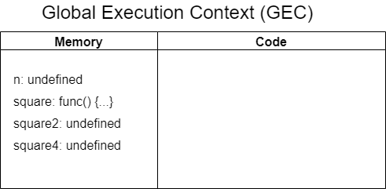

# How Javascript is executed?

`Javascript` - Synchronous, Single threaded language

`AJAX` - Asynchronous Javascript and XML

## Execution context

Execution context is the environment in which current code or function executes in.

Consists of **Creation Phase** and **Execution Phase**

Lets see execution context with simple diagram


In above image -

- Memory block (Memory Heap) - Where memory for variables and functions are assigned, known as **variable enviornment**. Initialized in **Creation Phase**

- Code block - Where code is executed in **Execution Phase**

## Execution with example

Now let us see the phases and variables are assigned and code is executed during those phases. With following example.

```javascript
var n = 2;

function square(num) {
  var ans = num * num;
  return ans;
}

var square2 = square(n);
var square4 = square(4);
```

### Creation Phase

1. Scripts executes for the first time, Javascript Engine creates Global Execution Context (**GEC**). Global object is created ( `window` in browser and `global` in Node.js )

2. Setups memory heap for variables and functions.

3. Stores function declarations and `undefined` as initial value for variables.



### Execution Phase

1. Javascript engine executes code line by line

2. Sets n = 2

3. During computing for variable `square2` and new execution context is created to execute function called **Function Execution Context**

4. In Function Execution Context same procedure happens during execution, Creation Phase and Execution Phase and when value is computed it returns the execution pointer back to GEC with return value.
5. Now variable `square2` is assigned with returned value 4
6. Similar process takes place for computing for `square4`


Once execution is done execution context is deleted.

When Functions are invoked new Execution context is created for function execution.
To handle this switch between execution context a **Call Stack** is implemented in the Javascript Engine.

## Call Stack

Lets consider the same above example.

We are currently in GEC, but when function `square` is invoked. A new execution context is pushed to call stack and execution is moved to the newly created EC.

Once the excution is done, EC is popped from **Call Stack** and execution is returned back to GEC.


